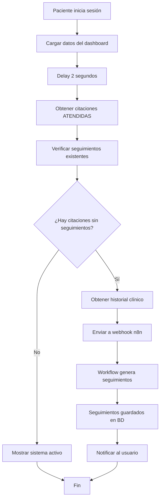

# 🔄 Sistema de Seguimientos Automáticos

## 📋 Descripción General

El sistema de seguimientos automáticos valida y genera seguimientos cardiovasculares para pacientes que tienen citaciones médicas en estado "ATENDIDA" pero no cuentan con seguimientos asociados.

## 🎯 Funcionalidad Principal

### ¿Cuándo se ejecuta?
- **Automáticamente** al iniciar sesión un paciente
- Se ejecuta **en segundo plano** después de cargar los datos del dashboard
- **No interfiere** con la experiencia del usuario

### ¿Qué hace?
1. **Verifica** si el paciente tiene citaciones en estado "ATENDIDA"
2. **Comprueba** si esas citaciones ya tienen seguimientos asociados
3. **Genera automáticamente** seguimientos faltantes usando el workflow de n8n
4. **Informa al usuario** del estado del proceso

## 🔧 Componentes Implementados

### 1. Servicio Principal
**Archivo:** `src/services/domain/seguimientos-automaticos.service.ts`

**Métodos principales:**
- `verificarCitacionesSinSeguimientos(pacienteId)` - Analiza citaciones del paciente
- `generarSeguimientosParaCitacion(citacionId, pacienteId, campanaId)` - Genera seguimientos
- `obtenerHistorialClinico(pacienteId)` - Obtiene datos médicos completos
- `validarYGenerarSeguimientos(pacienteId)` - Función principal de validación

### 2. Hook Actualizado
**Archivo:** `src/lib/hooks/usePacienteDashboard.ts`

**Nuevas funcionalidades:**
- Estado `validandoSeguimientos` para mostrar progreso
- Función `validarSeguimientosAutomaticos()` 
- Ejecución automática después de cargar datos del paciente

### 3. Componente de Notificación
**Archivo:** `src/components/pacientes/ValidacionSeguimientosAlert.tsx`

**Estados que muestra:**
- ⏳ **Validando**: "Activando Seguimientos Automáticos"
- ✅ **Completado**: "Sistema de Seguimientos Activo"
- ❌ **Error**: Mensaje de error específico

### 4. Página Actualizada
**Archivo:** `app/dashboard/paciente/page.tsx`

**Integración:**
- Muestra el componente de validación
- No bloquea la carga del dashboard
- Experiencia de usuario fluida

## 🔗 Integración con n8n

### Workflow Utilizado
**Archivo:** `Generador_de_seguimientos.json`

**Endpoint del webhook:**
```
POST /webhook/orquestador-seguimientos
```

### Datos Enviados
```json
{
  "evento": "citacion_atendida",
  "paciente_id": 123,
  "citacion_id": 456,
  "campana_id": 789,
  "fecha_atencion": "2024-12-12T14:30:00Z",
  "historial_clinico": {
    "datos_cardiovasculares": { ... },
    "triaje_inicial": { ... },
    "prediccion_riesgo": { ... }
  },
  "timestamp": 1702389000000
}
```

### Procesamiento del Workflow
1. **Preparar para Groq**: Analiza datos del paciente
2. **Basic LLM Chain**: Procesa con IA cardiovascular
3. **Procesar Respuesta IA**: Extrae análisis médico
4. **K-means Clasificación**: Clasifica riesgo cardiovascular
5. **Generar Seguimientos**: Crea plan personalizado
6. **HTTP Request**: Envía seguimientos al backend
7. **Respond to Webhook**: Confirma procesamiento

## 📊 Flujo de Ejecución



## 🧪 Casos de Prueba

### Caso 1: Paciente sin citaciones
- **Input**: Paciente nuevo sin citaciones
- **Output**: "Sistema de Seguimientos Activo" (sin generar nada)

### Caso 2: Paciente con citaciones no atendidas
- **Input**: Citaciones en estado "AGENDADA" o "CANCELADA"
- **Output**: "Sistema de Seguimientos Activo" (sin generar)

### Caso 3: Paciente con citaciones atendidas sin seguimientos
- **Input**: Citaciones "ATENDIDA" sin seguimientos asociados
- **Output**: Genera seguimientos automáticamente

### Caso 4: Paciente con seguimientos completos
- **Input**: Todas las citaciones ya tienen seguimientos
- **Output**: "Sistema de Seguimientos Activo" (sin generar nuevos)

## 🔧 Configuración Requerida

### Variables de Entorno
```env
# URL del webhook de n8n
NEXT_PUBLIC_N8N_WEBHOOK_URL=http://localhost:5678/webhook
```

### Endpoints Backend Necesarios
- `GET /api/seguimientos/paciente/{id}` - Seguimientos del paciente
- `GET /api/seguimientos/citacion/{id}` - Seguimientos por citación
- `POST /webhook/orquestador-seguimientos` - Webhook n8n

## 📈 Logs y Monitoreo

### Logs Principales
```javascript
// Inicio de validación
🔍 Iniciando validación automática de seguimientos para paciente: 123

// Análisis de citaciones
📊 Análisis completado: 3 citaciones analizadas, 1 sin seguimientos

// Generación de seguimientos
🔧 Generando seguimientos para citación 456
📡 Enviando datos al webhook de n8n: http://localhost:5678/webhook/orquestador-seguimientos
✅ Seguimientos generados exitosamente

// Resultado final
🎉 Validación completada: { seguimientos_generados: 1, errores: [] }
```

### Métricas Monitoreadas
- Citaciones analizadas por paciente
- Seguimientos generados automáticamente
- Errores en el proceso
- Tiempo de respuesta del webhook

## 🚨 Manejo de Errores

### Errores Capturados
1. **Error obteniendo citaciones**: Continúa sin generar seguimientos
2. **Error obteniendo seguimientos**: Asume que no hay seguimientos
3. **Error en webhook n8n**: Registra error pero no bloquea UI
4. **Error obteniendo historial**: Envía estructura mínima a n8n

### Estrategia de Recuperación
- **Graceful degradation**: La UI sigue funcionando aunque falle la validación
- **Reintentos automáticos**: El usuario puede recargar la página para reintentar
- **Logs detallados**: Para depuración y monitoreo

## 🎯 Beneficios del Sistema

1. **Automatización completa**: Sin intervención manual
2. **Detección inteligente**: Solo genera seguimientos faltantes
3. **Experiencia fluida**: No interrumpe el flujo del usuario
4. **Integración robusta**: Usa el workflow existente de n8n
5. **Manejo de errores**: Falla de forma elegante
6. **Monitoreo completo**: Logs detallados para seguimiento

## 🔮 Mejoras Futuras

1. **Cache inteligente**: Evitar validaciones repetidas en la misma sesión
2. **Notificaciones push**: Informar cuando se completen los seguimientos
3. **Dashboard de métricas**: Panel de control para administradores
4. **Validación periódica**: Ejecutar validación cada X horas
5. **Configuración personalizable**: Permitir activar/desactivar por usuario 