# 🩺 **Manual de Usuario**  
## Sistema de Gestión de Campañas de Salud

---

## 1. 🚀 Introducción

### 1.1 🎯 Propósito del Sistema
El **Sistema de Gestión de Campañas de Salud** organiza y ejecuta campañas enfocadas en el riesgo cardiovascular en comunidades rurales.  
Facilita el registro, triaje y seguimiento de pacientes, permitiendo:

- 📋 Registro sencillo de pacientes
- 🩺 Triaje inicial interactivo
- 📊 Análisis de datos para predicción y priorización médica

> **Nota:** El sistema utiliza el modelo de riesgo cardiovascular **Framingham** y modelos de IA para mejorar la toma de decisiones.

---

### 1.2 👥 Roles de Usuario

| Rol                | Descripción                                                                 |
|--------------------|-----------------------------------------------------------------------------|
| **Paciente**       | Participa en campañas y realiza triajes                                     |
| **Embajador**      | Gestiona y da seguimiento a pacientes                                       |
| **Entidad de Salud** | Organiza y gestiona campañas                                               |
| **Personal Médico**| Atiende pacientes y realiza diagnósticos                                    |
| **Desarrollador**  | Mantiene y mejora el sistema                                                |
| **Administrador**  | Administra entidades y usuarios                                             |

---

## 2. 🔐 Acceso al Sistema

### 2.1 📝 Registro de Actores

#### **Registro de Entidades Médicas** *(Rol Administrador)*

1. Acceso al panel de administración  
   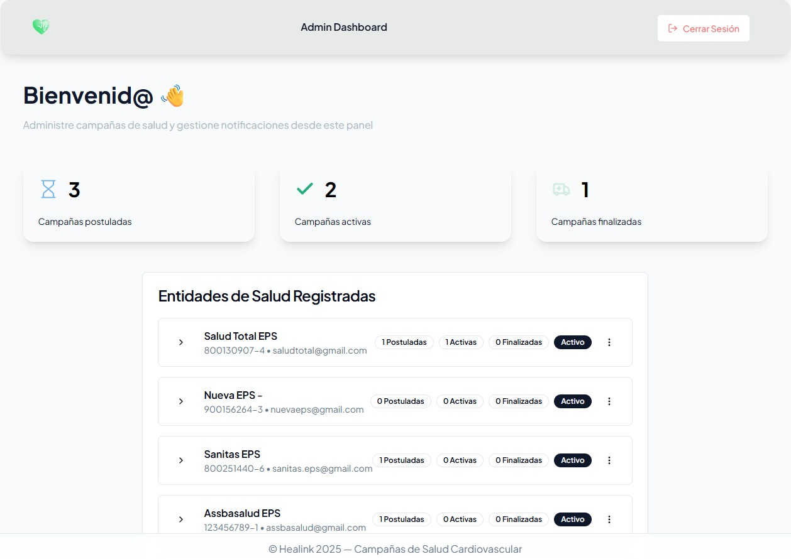
2. Complete el formulario:
   - Razón social
   - Dirección
   - Teléfono
   - Correo electrónico
   - Documentación legal  
   
3. La entidad podrá iniciar sesión.
4. Posteriormente se pueden visualizar las campañas registradas por el Admin
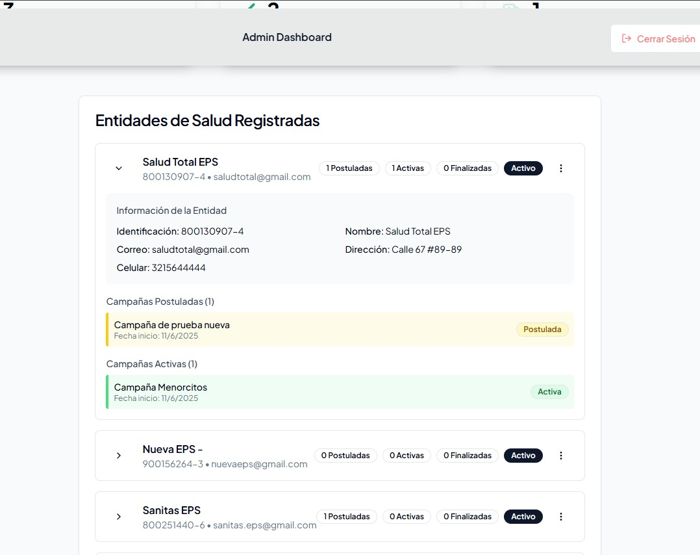
6. Se podrá editar la información de las campañas registradas
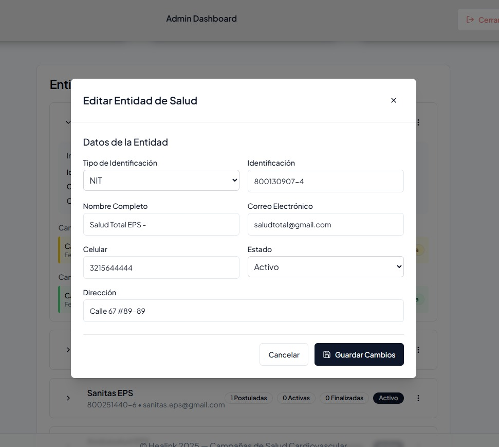

---

#### **Registro de Embajadores, Personal Médico y Campañas** *(Rol Entidad de Salud)*

1. Acceda al panel de gestión desde donde podremos visualziar información como:
   - #### **Embajadores** 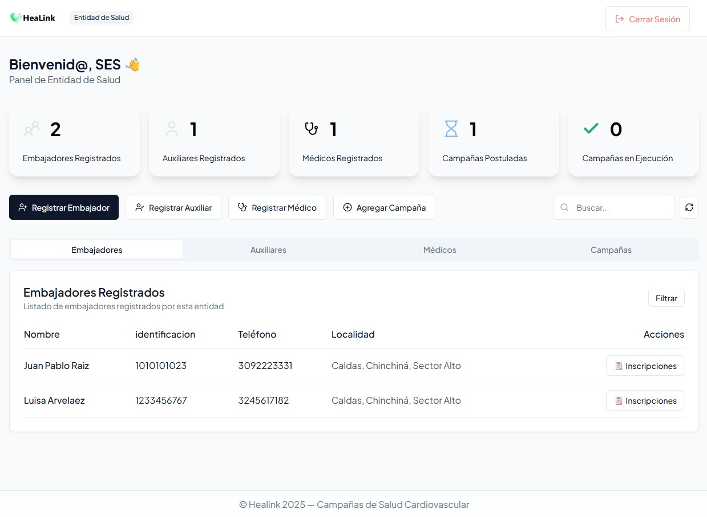
   - #### **Auxiliares** 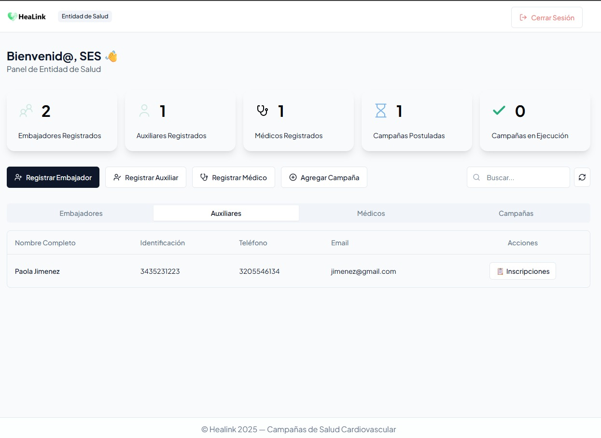
   - #### **Médicos** 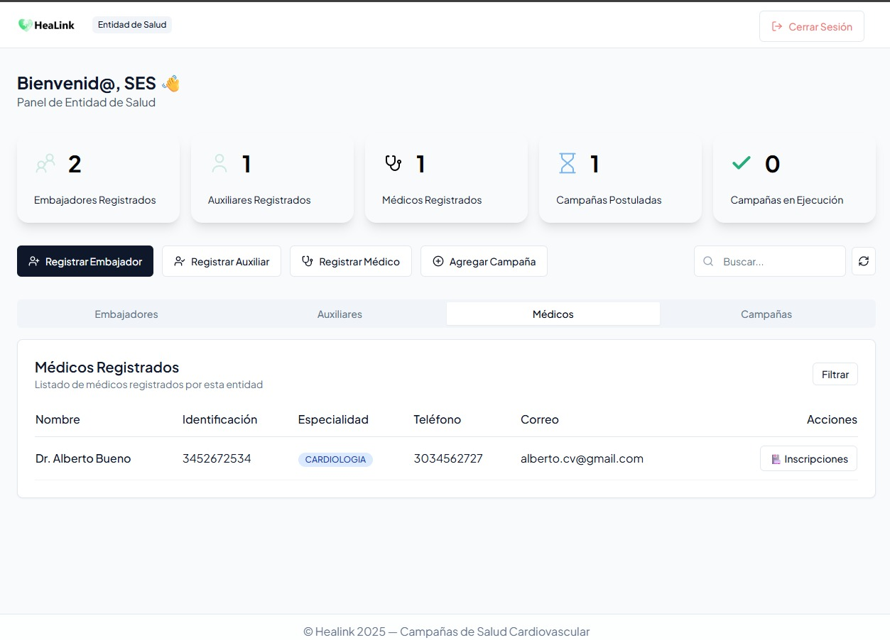
   - #### **Campañas** 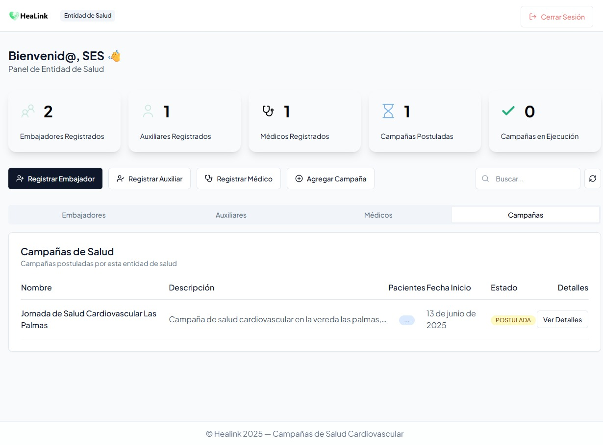

2. Opciones de creación desde el Panel de Entidad de Salud:
   - Registrar Embajador 
   - Registrar Médico 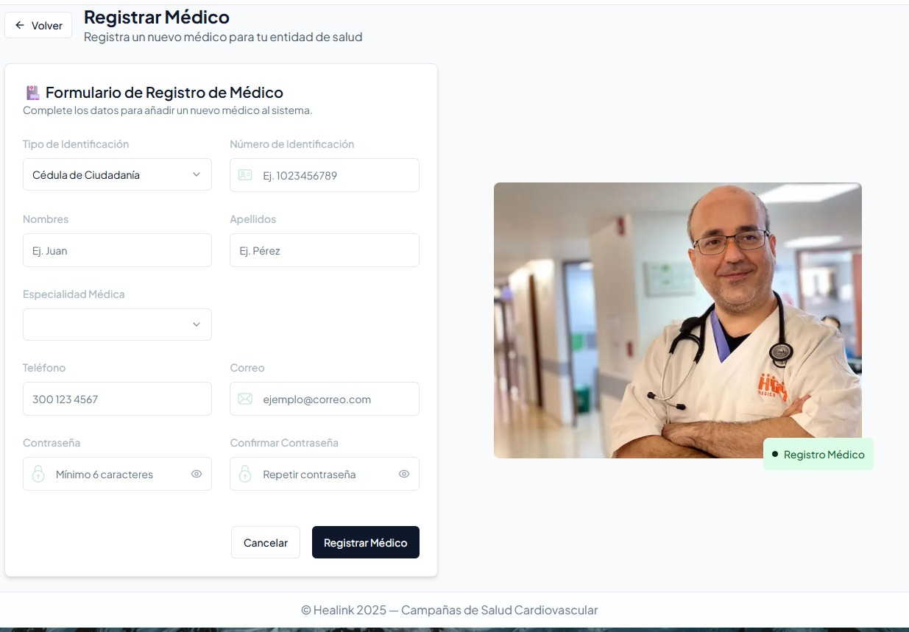
   - Registrar Auxiliar 
   - Registrar Campaña 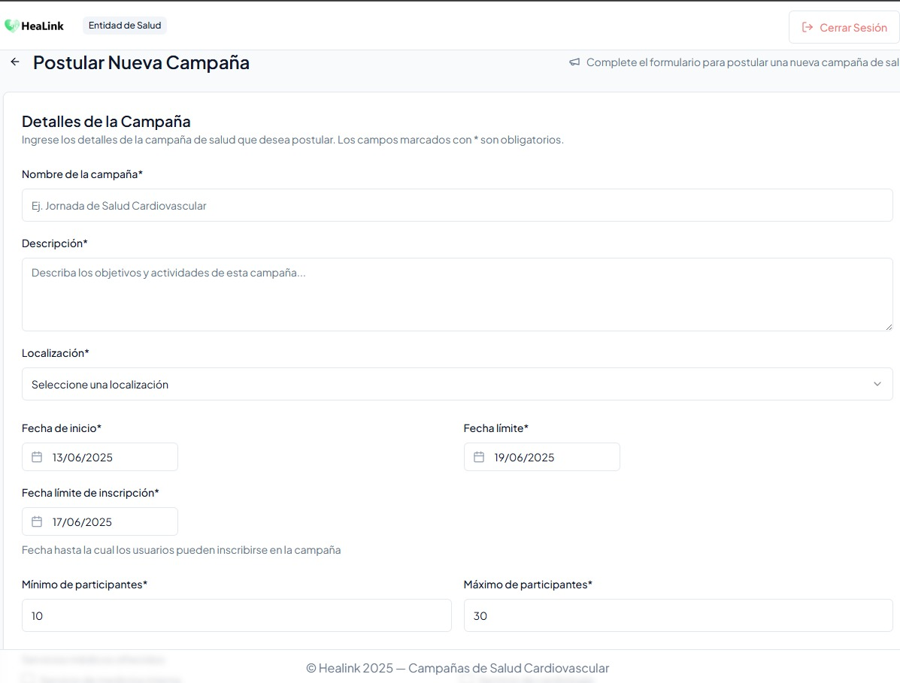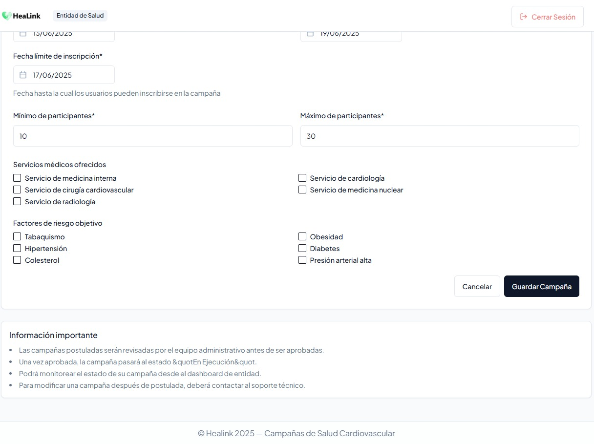
3. Se deben completar los campos **OBLIGATORIOS** según el registro que corresponda.

#### Registro de actores en Campañas
Desde cualquier pestaña (Emabajdor, Médico, Auxiliar) cada usuario tiene dentro de sus acciones la opción de **"Inscripciones"**

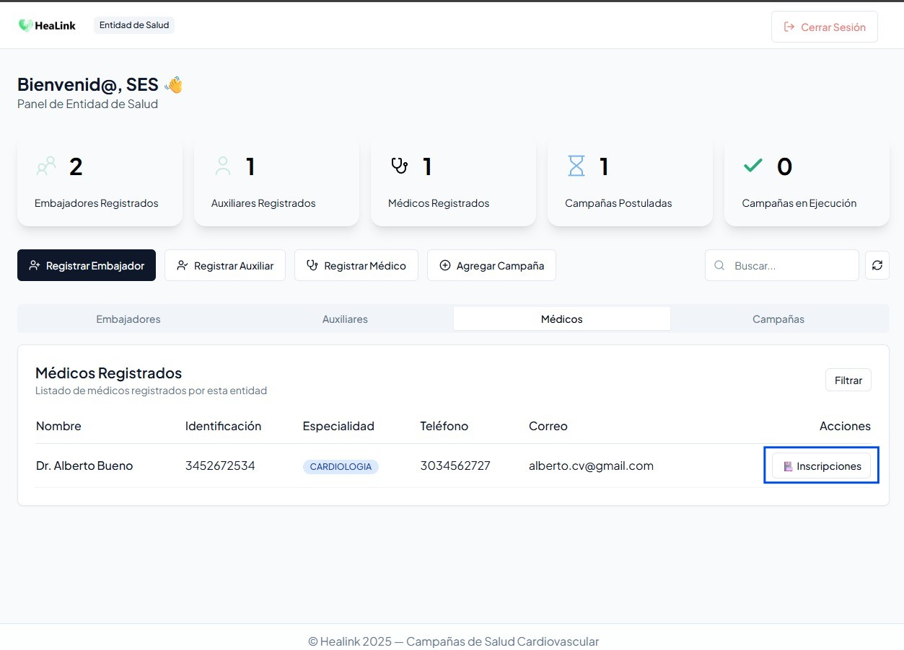
Desde allí podemos realizar la incripción de nuestro actor a cualquier campaña:
   
Adicionalmente, también podremos desvincular cualqueir actor de la campaña:
   

---

#### **Registro de Pacientes** *(Rol Embajador)*

1. Accedemos desde el panel de embajador donde se podrán visualizar inicialmente los pacientes registrados por el mismo.
   
2. Seleccione **Registrar Paciente**  
     
   
3. Complete el formulario:
   - Datos personales
   - Información médica básica
   - Contacto de emergencia
   - Selección de campaña
4. El paciente recibe una notificación de se ha registrado en una campaña.

---

### 2.2 🔑 Inicio de Sesión

   - 

1. Seleccione tipo de identificación, ingrese número de identificación y contraseña.
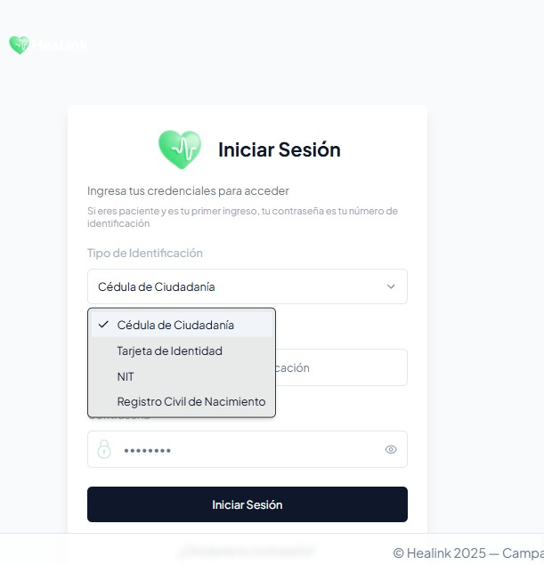
2. Haga clic en **Iniciar Sesión**.
3. Una vez la autenticación sea exitosa se cargará la vista personalizada según el rol.

---

## 3. 🧑‍⚕️ Panel de Paciente
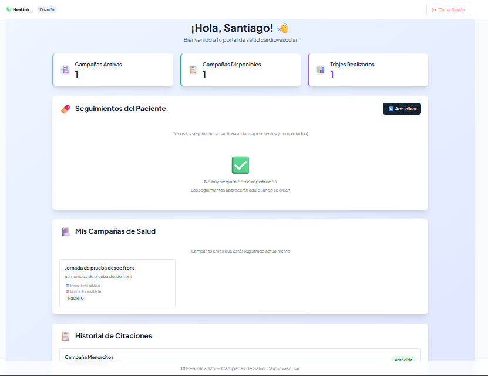
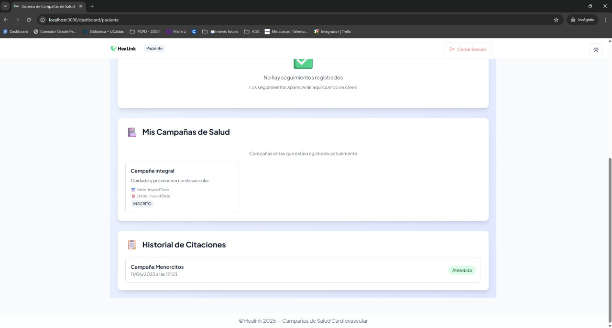

### 3.1 📊 Dashboard

- Número de campañas activas
- Campañas disponibles
- Triajes realizados
### Al iniciar sesión por primera vez, dede completar un triaje inicial  
  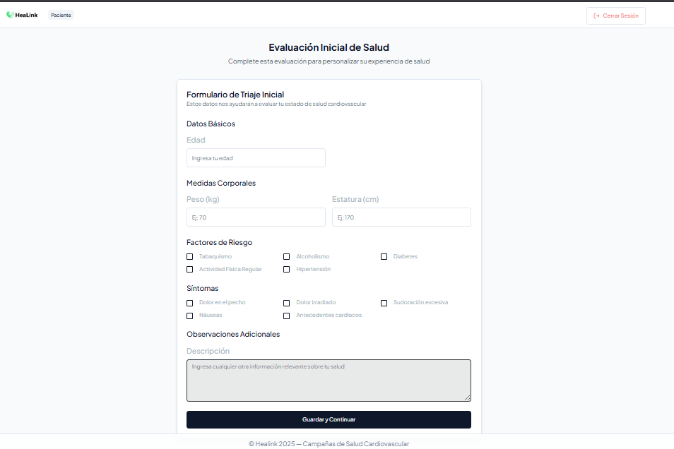

### Se podrá visualizar estadísticas e información almacenda del paciente como:
- 
- 
- 

- Foto
---

## 4. Panel del Medico

## 5. Panel del Auxiliar

> **ℹ️ Nota:** Este manual está sujeto a actualizaciones. Consulte la documentación en línea para la versión más reciente. 