# Manual de Usuario - Sistema de Gestión de Campañas de Salud

## 1. Introducción

### 1.1 Propósito del Sistema
El Sistema de Gestión de Campañas de Salud tiene como objetivo principal organizar y ejecutar campañas de salud enfocadas en el riesgo cardiovascular en comunidades rurales. Esta plataforma web facilita la gestión de la participación de los pacientes en jornadas de salud mediante un proceso sencillo de registro y triaje inicial.

El sistema permite a los embajadores de salud recolectar un listado de personas interesadas en participar, gestionar el registro de pacientes y realizar un triaje utilizando un formulario interactivo. Dicho triaje está diseñado para recoger información relevante sobre el historial médico, síntomas actuales y factores específicos de la comunidad, como los ambientales, sociales y raciales. Las respuestas del paciente se estructuran siguiendo el modelo de riesgo cardiovascular Framingham, lo que permite identificar el nivel de riesgo y priorizar la atención médica adecuada.

Además, el sistema recolecta datos valiosos que, al ser analizados mediante modelos de inteligencia artificial (IA), posibilitan la predicción de diagnósticos, la recomendación de tratamientos personalizados y la priorización de citas, basándose en el estado de salud del paciente, su porcentaje de asistencia a las citas previas, así como las anotaciones médicas. Esto permite mejorar la toma de decisiones médicas, optimizar recursos y asegurar una atención oportuna, especialmente en comunidades rurales con recursos limitados.

### 1.2 Roles de Usuario
El sistema cuenta con cinco tipos de usuarios principales:

- **Paciente**: Usuarios que pueden participar en campañas de salud y realizar triajes.
- **Embajador**: Usuarios que gestionan y dan seguimiento a los pacientes en las campañas.
- **Entidad de Salud**: Organizaciones que crean y gestionan campañas de salud.
- **Personal Médico**: Usuarios que realizan las atenciones a los pacientes, realizan diganósticos y prestan el servicio a los pacientes.
- **Desarrollador**
- **Administrador**

## 2. Acceso al Sistema

### 2.1 Registro de Actores
1. Acceda a la página principal del sistema
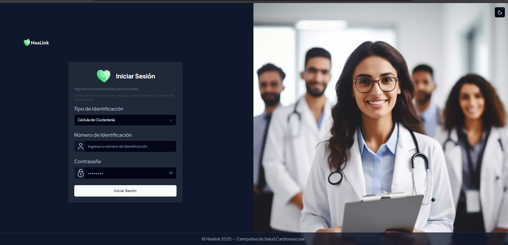
1. **Registro de Entidades Médicas**
   - Solo el Administrador puede registrar nuevas entidades médicas
   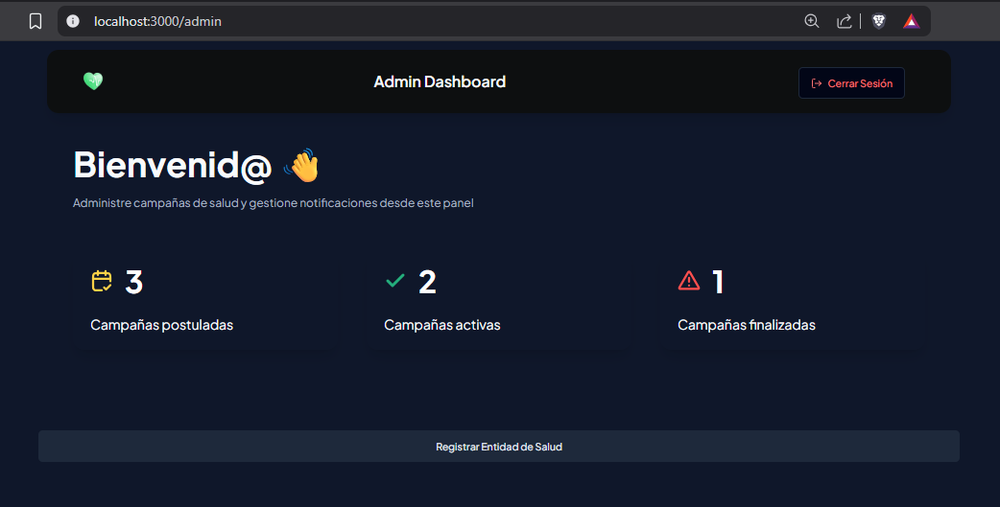
   - Proceso:
     1. El administrador accede al panel de administración
     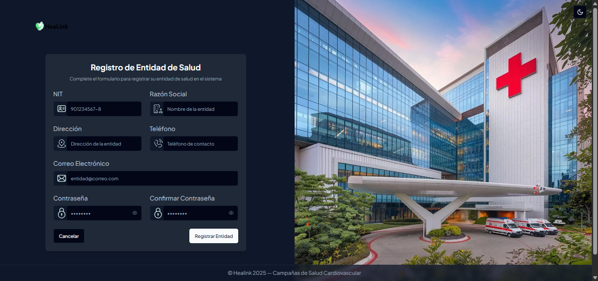
     2. Completa el formulario de registro de entidad con:
        - Razón social
        - Dirección
        - Teléfono
        - Correo electrónico
        - Documentación legal
     3. La entidad ya queda disponible para que inicie sesión.

2. **Registro de Embajadores y Personal Médico**
   - Solo las Entidades de Salud pueden registrar tanto los embajadores como el personal médico (Médicos y Auxiliares)

   - Proceso:
     1. La entidad accede a su panel de gestión
     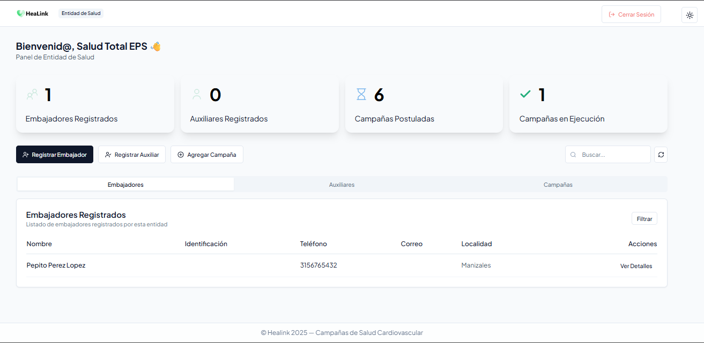
     2. Selecciona:
         - Registrar Embajador
      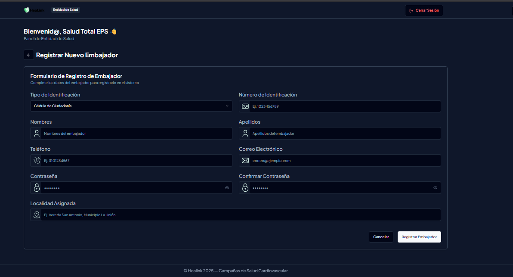
         - Registrar Médico
      
         - Registrar Auxiliar
      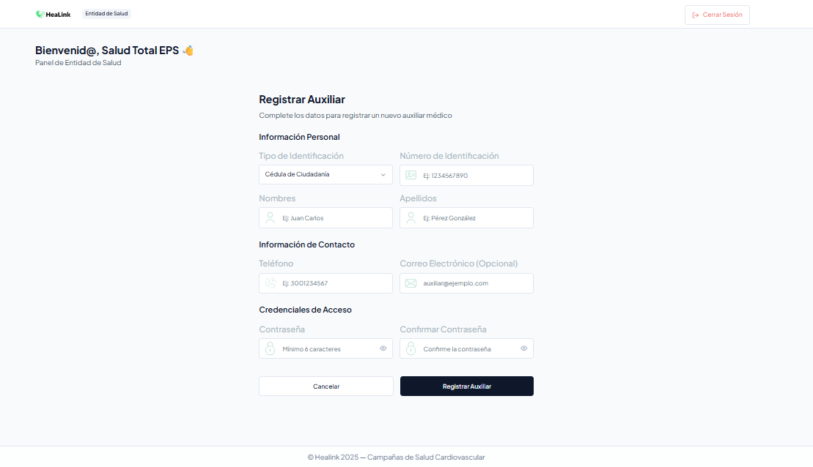
     3. Completa el formulario con:
        - Datos personales del embajador
        - Área de especialización en el caso de médico
        - Zona
     4. Tanto el embajador como el personal médico recibe credenciales de acceso
     5. Así mismo mismo se tiene que asignar una campaña a la cual se inscribirá.
     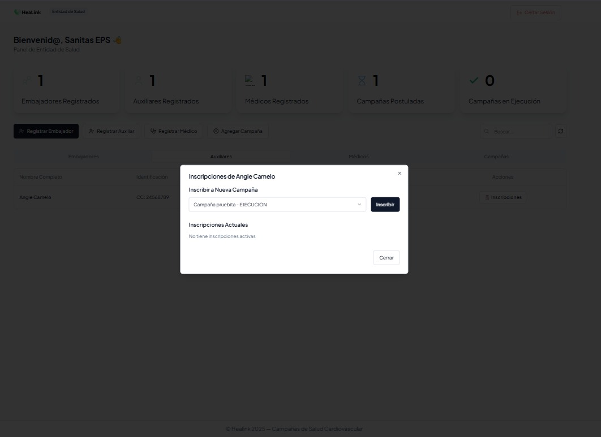
     7. Así mismo se puede eliminar la referencia
     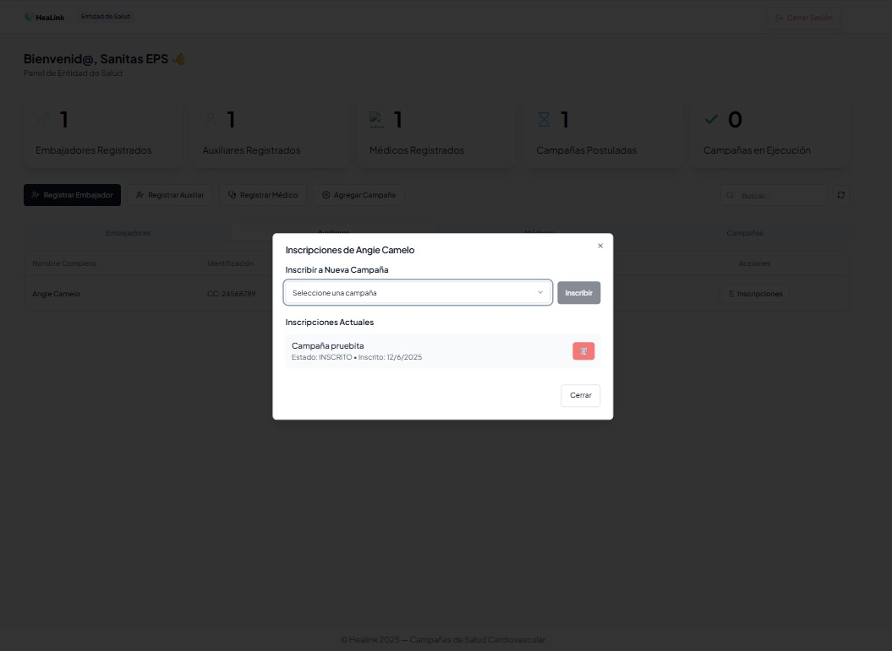

3. **Registro de Pacientes**
   - Solo los Embajadores pueden registrar pacientes
   - Proceso:
     1. El embajador accede a su panel
     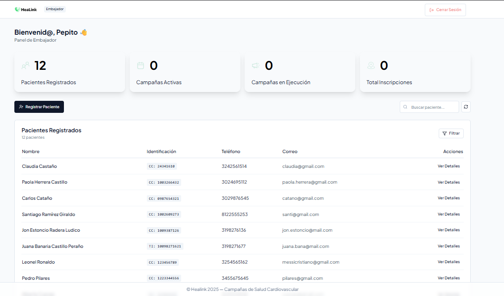
     2. Selecciona "Registrar Paciente"
      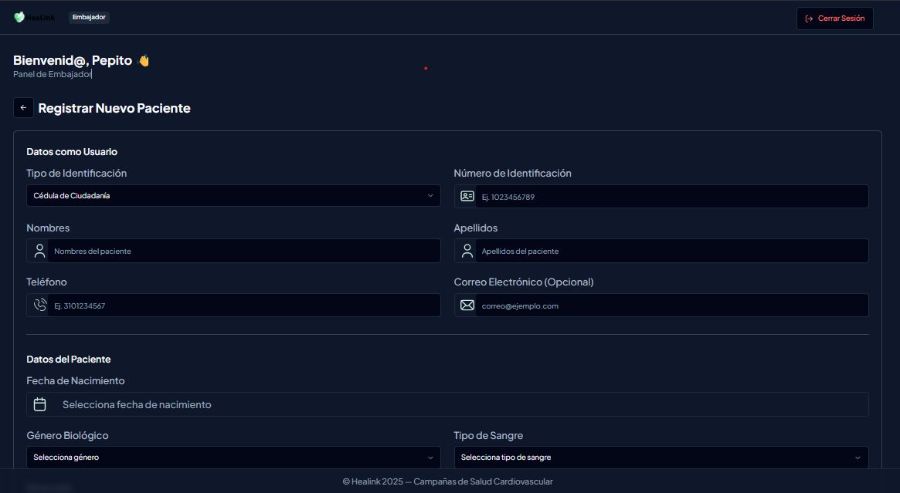
      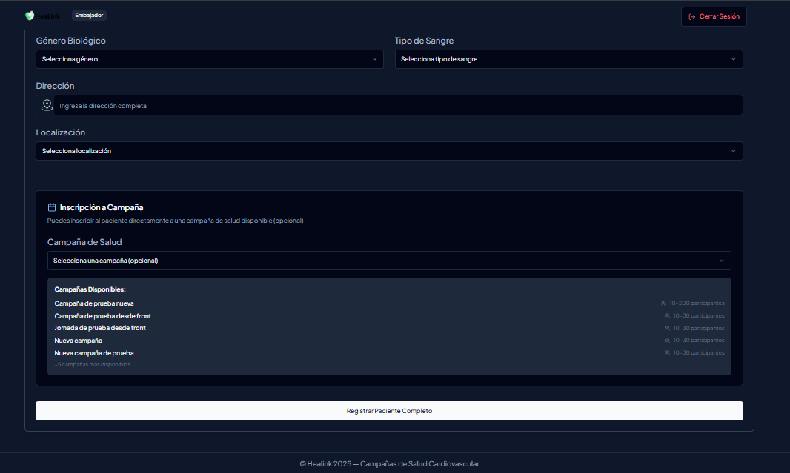
     3. Completa el formulario con:
        - Datos personales del paciente
        - Información médica básica
        - Contacto de emergencia
        - Selección de la Campaña a la cual será asignado
     4. El paciente recibe credenciales de acceso

### 2.2 Inicio de Sesión

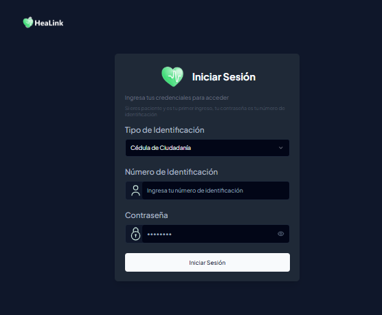

1. Seleccionar el tipo de identificación, ingrese el # de identificación y la contraseña
2. Haga clic en "Iniciar Sesión"
3. Si olvidó su contraseña, utilice la opción "¿Olvidó su contraseña?"
4. Ya dependiendo del rol del usaurio se cargará su vista personalizada.

## 3. Panel de Paciente

### 3.1 Dashboard
El dashboard del paciente muestra:
- Número de campañas activas
- Campañas disponibles
- Triajes realizados

### 3.2 Gestión de Campañas
#### Ver Campañas Disponibles
1. Acceda a la sección "Campañas" desde el Dashboard de Entidades

2. Explore las campañas disponibles
3. Cada campaña muestra:
   - Nombre
   - Descripción
   - Pacientes
   - Número de pacientes
   - Fecha de inicio
   - Estado actual

### 3.3 Triaje
#### Completar Triaje Inicial
1. Acceda a la sección "Triaje"
2. Complete el formulario de triaje inicial
3. Proporcione la información médica requerida
4. Guarde y envíe el formulario

## 4. Panel de Embajador

### 4.1 Dashboard
El dashboard del embajador muestra:
- Campañas asignadas
- Pacientes a cargo
- Estadísticas de seguimiento

### 4.2 Gestión de Pacientes
#### Ver Lista de Pacientes
1. Acceda a la sección "Pacientes" desde el Dashboard de Embajadores
2. Visualice la lista de pacientes asignados
3. Filtre por campaña o estado

#### Asignar Pacientes a Campaña
 - Cuando se realiza la creación del paciente este queda directamente asocaido a una campaña. Por lo que desde un inicio este ya pertenecerá a una campaña.

## 5. Panel de Entidad de Salud

### 5.1 Dashboard

El dashboard de la entidad muestra:
- Campañas asociadas

- Embajadores asignados
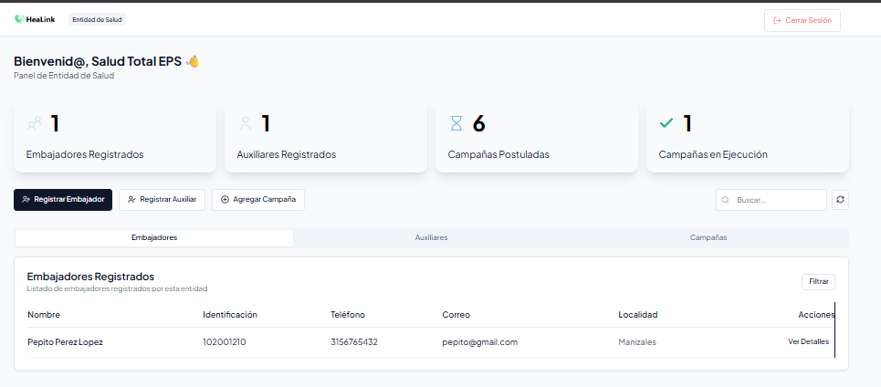
- Auxiliares asginados a la campaña y a la entidad
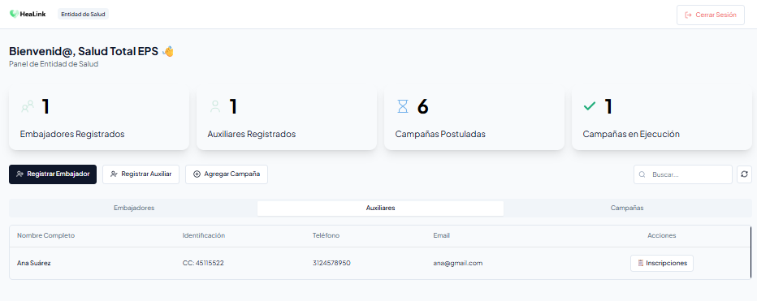

### 5.2 Gestión de Campañas
#### Crear Nueva Campaña
1. Desde el Dashboard de la Entidad de Salud podemos postular una nueva campaña

2. Haga clic en "Agregar Campaña"
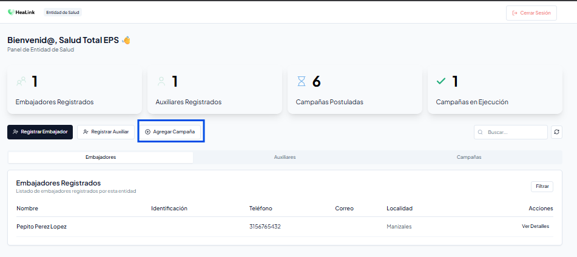

3. Complete el formulario con:
   - Nombre de la campaña
   - Descripción
   - Localización
   - Fechas de inicio, fin y límite de inscripción
   - Número mínimo y máximo de participantes
   - Requisitos

- 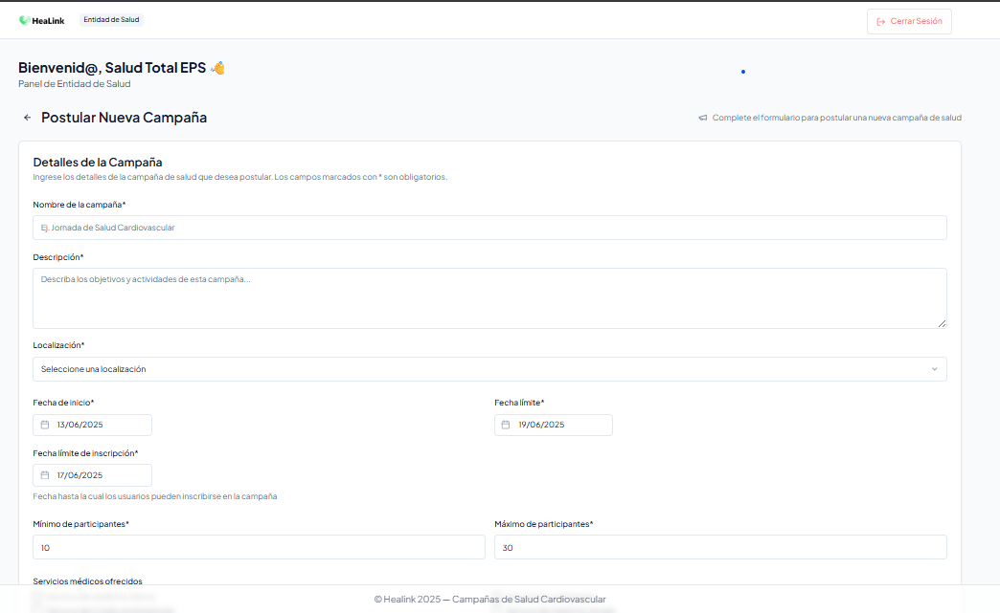

### 5.3 Gestión de Embajadores
#### Asignar Embajadores a Campañas
Una vez el embajador es creado desde el Dashboard de la Entidad de Salud, se asigna la Campaña a la cual quedará inscrito.

## 6. Funcionalidades Comunes

### 6.1 Perfil de Usuario
- Actualizar información personal
- Cambiar contraseña
- Configurar preferencias de notificación

### 6.2 Notificaciones
El sistema envía notificaciones para:
- Nuevas campañas disponibles
- Actualizaciones de estado
- Recordatorios importantes
- Mensajes del sistema

## 7. Solución de Problemas

### 7.1 Preguntas Frecuentes
1. **¿Cómo puedo recuperar mi contraseña?**
   - Utilice la opción "¿Olvidó su contraseña?" en la pantalla de inicio de sesión
   - Siga las instrucciones enviadas a su correo electrónico

2. **¿Cómo actualizo mi información personal?**
   - Acceda a su perfil de usuario
   - Haga clic en "Editar Perfil"
   - Actualice la información necesaria

3. **¿Qué hago si no puedo acceder a una campaña?**
   - Verifique que cumple con los requisitos
   - Contacte al embajador asignado
   - Comuníquese con soporte técnico

### 7.2 Contacto de Soporte
Para asistencia técnica:
- Email: soporte@sistema.com
- Teléfono: (123) 456-7890
- Horario de atención: Lunes a Viernes, 8:00 AM - 6:00 PM

---

**Nota**: Este manual está sujeto a actualizaciones. Para la versión más reciente, consulte la documentación en línea. 